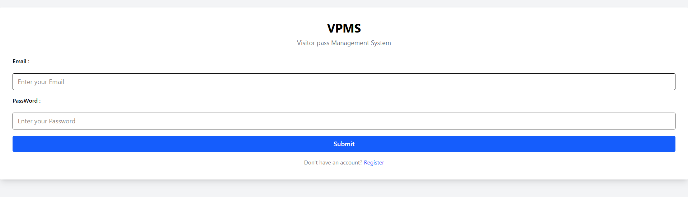
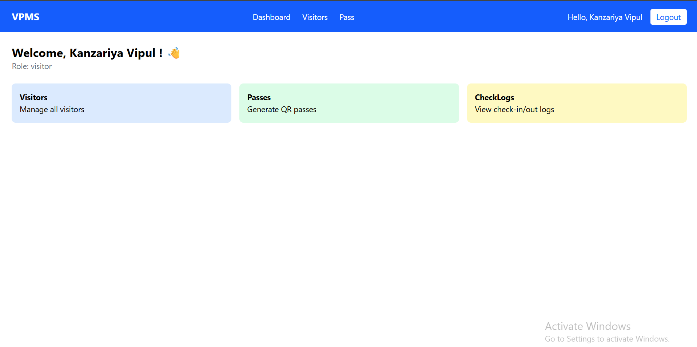
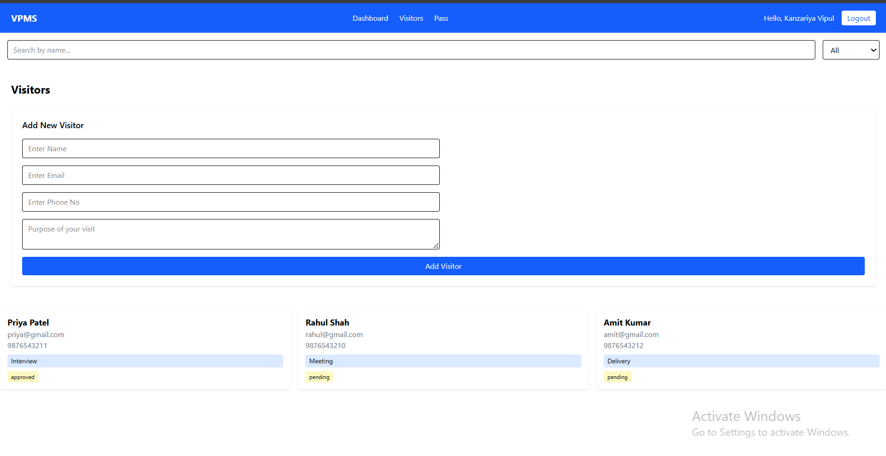
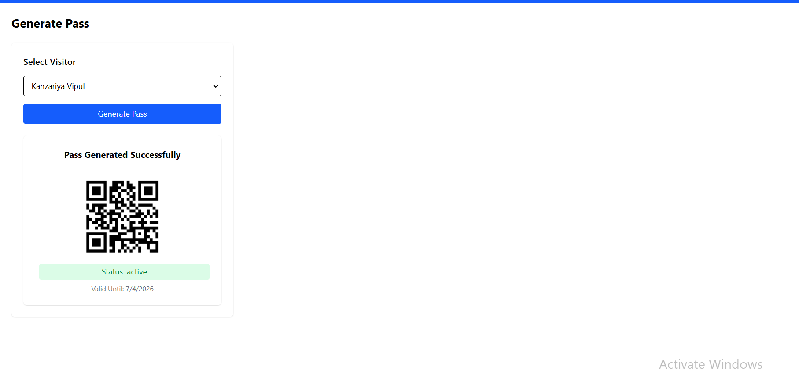

# Visitor Pass Management System (VPMS)

A full-stack MERN application to digitize visitor management in offices.

##  Live Demo

- **Frontend:** https://visitor-pass-management-system1.netlify.app
- **Backend:** https://visitor-pass-management-system-1cve.onrender.com

## Demo video Link
https://youtu.be/W0iyvV0wdcg

## github 
https://github.com/vipul-kanzariya/visitor-pass-management-system

##  Screenshots

### Login Page

### Dashboard

### Visitors Page

### Pass Generation

##  Demo Data (Seed Script)

Run this command to populate demo data:

cd backend
npm run seed

## Tech Stack

    -> Frontend: React, Vite, Tailwind CSS, Axios
    -> Backend: Node.js, Express.js
    -> Database: MongoDB (Mongoose)
    -> Auth: JWT (JSON Web Tokens)
    -> QR Code: qrcode npm package

##  Project Structure

── backend/
── frontend/

##  Setup Guide

### Backend Setup

cd backend
npm install

Run backend:  npm run dev

### Frontend Setup

cd frontend
npm install

Run frontend: npm run dev

# API EndPoints

 POST /api/auth/register | Register new user |
 POST /api/auth/login | Login user |
 GET  /api/auth/me | Get current user |

### Visitors

 GET  /api/visitors | Get all visitors |
 POST /api/visitors | Create new visitor |

### Passes
 POST /api/pass | Generate QR pass |

### CheckLog

 POST  /api/checkLog/checkIn | Check in visitor |
 PUT   /api/checkLog/checkOut/:id | Check out visitor |

## User Roles

 Admin | Full system access |
 Security | Issue passes, scan QR |
 Employee | Invite visitors |
 Visitor | View digital pass |

##  Features

- JWT Authentication & Role-based Authorization
- Visitor Registration
- QR Code Pass Generation
- Check-In / Check-Out Logs
- Protected Routes
- Responsive UI with Tailwind CSS

## 👨‍💻 Developer

- **Name:** Vipul Kanzariya
- **University:** Saurashtra University
- **Course:** BCA Semester 5

